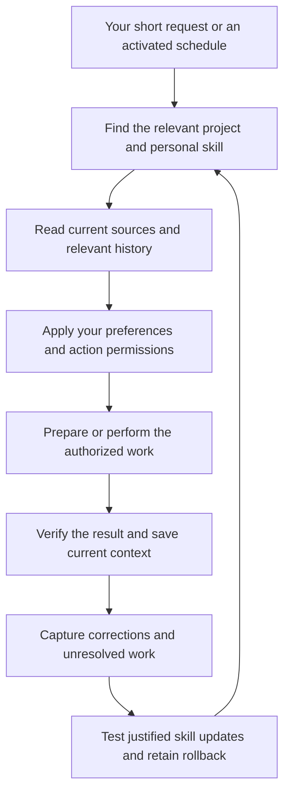

# Codex Second-Brain Workspace

Set up Codex as a working assistant that knows your projects, finds the relevant history, uses your tools, writes in your style and handles the recurring work you choose, without rebuilding the context in every conversation.

This toolkit guides you from an unconfigured Codex workspace to a connected, personal working environment. You can start without a project folder or any connected accounts. It contains the setup instructions, second-brain builder and ongoing learning method that Codex follows; Codex performs the work with the tools and access available in your environment.

## What you should have after setup

- **Connected working tools:** the email, calendar, files, task manager and other services your workflows need, with the relevant capabilities tested.
- **A source-linked second brain:** your project files preserved, converted into full Markdown copies where supported, and organized into linked topics and indexes. Unread or unsupported material remains visible.
- **Context about how you work:** a reviewed map of your projects, responsibilities, writing style, routines and preferred cadence, learned from the history you choose to share.
- **Personal skills that do useful jobs:** for example, preparing for meetings, drafting replies, following up on work or producing a weekly review, created and tested for your actual needs.
- **Continuity and improvement:** decisions, corrections and unfinished work saved for later tasks, plus a method for updating skills, checking that changes help and restoring an earlier version if needed.
- **The recurring work you select:** configured routines with clear outputs, notifications and recovery steps, where the available scheduler supports them.

## Say less. Get work done with your context.

After setup, the goal is to make ordinary requests feel this simple:

| You say | What Codex is configured to do in the background |
| --- | --- |
| **“Prepare me for tomorrow's meetings.”** | Check your calendar in your timezone, identify the relevant projects and people, read current emails and documents, recover earlier decisions and open actions, and prepare a source-linked brief for each meeting. |
| **“Draft a reply.”** | Read the full conversation, retrieve relevant earlier discussions and commitments, select your writing style for that person and language, and prepare a reply grounded in the current facts. |
| **“What needs my attention?”** | Reconcile project changes, deadlines, unanswered commitments and blockers with the latest email, calendar and task state, then show what matters and what you can do next. |
| **“Next time, do it this way.”** | Save the correction in the right context, update the affected personal skill when authorized, test it against the corrected case and a previous successful case, and keep the earlier version available for rollback. |

You should not have to add “use my emails”, “check the project documents” or “write in my style” every time. Setup makes relevant context and your confirmed preferences part of the normal workflow. Sources that cannot be accessed remain visible gaps.

## Useful work even when you have not asked

Setup walks you through choosing and activating real schedules:

- **Meeting preparation:** have briefs prepared at your chosen time, using the same context-aware skill you can invoke yourself.
- **Attention checks:** look for meaningful changes, approaching deadlines and things waiting on you. Keep track of what was already surfaced or resolved, so unchanged items do not become repeated nudges.
- **Daily maintenance:** refresh changed source material, update affected Markdown copies, topic clusters and indexes, reconcile open work, and review your registered personal skills for improvements supported by corrections or actual failures.

The daily run reviews all registered personal skills. It changes only those that need a justified improvement, checks the change and preserves a rollback version. Clear corrections can be incorporated during your work without waiting for the next daily run. Quiet runs stay quiet unless you choose regular reports; actionable changes, failures and decisions reach you under your notification preferences.



This is the operating experience the toolkit configures and helps you verify. It depends on your connected tools, authorized sources and an available execution environment. Downloading the ZIP alone does not activate schedules. Codex retrieves maintained context; it does not automatically know every past conversation or retrain its underlying model.

## How setup works

Codex first asks what the workspace is for and whether you have a local folder. It then helps you connect each needed service one step at a time. After agreeing which history to review, it reads your own sent messages, relevant threads and calendar records, presents its findings for correction, and creates your personal skills. It builds the second brain, tests the selected workflows and establishes the ongoing learning process.

You complete sign-ins and choose the scope and actions you want. Codex carries out the setup work it can perform and guides you through the steps that require your interaction.

**Current status: v0.1.2 prerelease.** Structural checks and automated tests pass, but the complete beginner experience across real account sign-ins and a full working environment has not yet been demonstrated. See [verification status](#verification-status).

## Start here

1. Open [v0.1.2 Releases](https://github.com/gadekko/codex-second-brain-workspace/releases/tag/v0.1.2) and download **codex-second-brain-workspace.zip** from **Assets**. No repository invitation is needed. Alternatively, use **Code → Download ZIP** for the latest repository files.
2. Give Codex access to the extracted folder, or attach the ZIP if your Codex environment can read it.
3. Send:

> Read START_HERE.md in this bundle and guide me through setup from the beginning. Ask what my second brain is for and whether I have a local project folder. Help me connect each needed tool one step at a time. Agree which messages and calendars you may review, learn my writing style and routines, and help me review a workflow map. Create and test useful personalized skills in my private workspace, then build the second brain and set up the recurring work I choose.

Follow [START_HERE.md](START_HERE.md) for direct-file use, installation and the local-only option. You still complete your own sign-ins, account permissions and project choices.

## The toolkit and your working environment

This repository is the reusable toolkit. It contains generic methods and synthetic tests, not its author's messages, receipts, calendar, client files or working history.

Your own workspace is where your actual work belongs. It may be a local folder, your own private repository, connected services, or a combination. It is expected to contain your authorized documents, correspondence, project context, learned preferences and personal skills. Keeping the shared toolkit generic does **not** prohibit private data in your private workspace or private repository. Keep credentials in an appropriate secret store, and choose actual access/backup arrangements for your data.

The setup establishes a map of your projects, responsibilities, tools and workflows. Daily work then uses the relevant current context, performs the actions you have authorized, verifies the result, and records what changed. The [continuous-learning method](skills/setup-codex-workspace/references/continuous-learning.md) turns corrections and demonstrated workflow improvements into tested skill updates with version history and rollback. It updates files and skills; it does not retrain the underlying model or create unlimited automatic access to all your information.

## Included skills

| Skill | Purpose |
| --- | --- |
| [setup-codex-workspace](skills/setup-codex-workspace/SKILL.md) | Guided connections; scoped email/calendar discovery; voice and workflow profiles; personalized skill creation, installation and testing; memory and automation setup |
| [maintain-codex-workspace](skills/maintain-codex-workspace/SKILL.md) | Daily source refresh, attention reconciliation and evidence-based personal skill updates with tests and rollback |
| [create-project-second-brain](skills/create-project-second-brain/SKILL.md) | Local corpus inventory, preserved originals, full Markdown clones, topic clusters, source indexes and updates |

No separately installed second-brain skill or hosted database is required. Codex needs access to your selected files and suitable conversion/OCR tools for their formats. Recurring work requires a supported scheduler. Specialized dispute and investment builders are optional and not included.

## Verification status

See [VERIFICATION.md](VERIFICATION.md) for completed checks and limits. This is a reusable method package, not a standalone application. A full first-time-user walkthrough across real account sign-ins has not yet been demonstrated. Package validation does not establish universal source-conversion accuracy or unattended reliability.

## Build and check the downloadable bundle

Python 3.9+ with the standard library is sufficient:

```sh
python3 -B scripts/build_bundle.py --check
python3 -B -m unittest discover -s skills/create-project-second-brain/scripts -p 'test_audit_brain.py' -v
python3 -B -m unittest discover -s scripts -p 'test_build_bundle.py' -v
python3 -B scripts/build_bundle.py
```

The last command writes `dist/codex-second-brain-workspace.zip`. It packages only the method files listed in `MANIFEST.json`, not Git metadata, project documents or local caches, and verifies the archive bytes. After intentional method changes, inspect the diff, run `python3 -B scripts/build_bundle.py --refresh`, and commit the updated manifest with those changes.

GitHub Actions runs the integrity and audit-helper tests on pushes and pull requests. The workflow also checks that the distributable ZIP builds.

## Sharing

The reusable toolkit contains generic methods and synthetic tests only. Never seed it with its author's private work or copy a user's private workspace back into this toolkit distribution. This is a rule for the shared method repository and its release ZIP, not a ban on real data in users' own private repositories. Source history is read within the accounts, date range and areas the person selects. Observed patterns remain tentative until reviewed; sign-in does not grant permission for an unrestricted scan or automatic sending.

The bundle checker rejects common private email addresses, home-directory paths and credential patterns in method payloads. This is a limited check, not proof that arbitrary prose contains no private information; inspect every intended release's content as well.

This repository and its releases are public. Anyone can view the toolkit and download the release ZIP. You can also share the generated ZIP separately; it contains the reusable methods, not your connected accounts or personal second brain. Give each project its own private working folder.

## License

Copyright (C) 2026 Marco Poblete.

This toolkit is licensed under the GNU Affero General Public License, version 3 only (`AGPL-3.0-only`). See [LICENSE](LICENSE) for the full terms.
